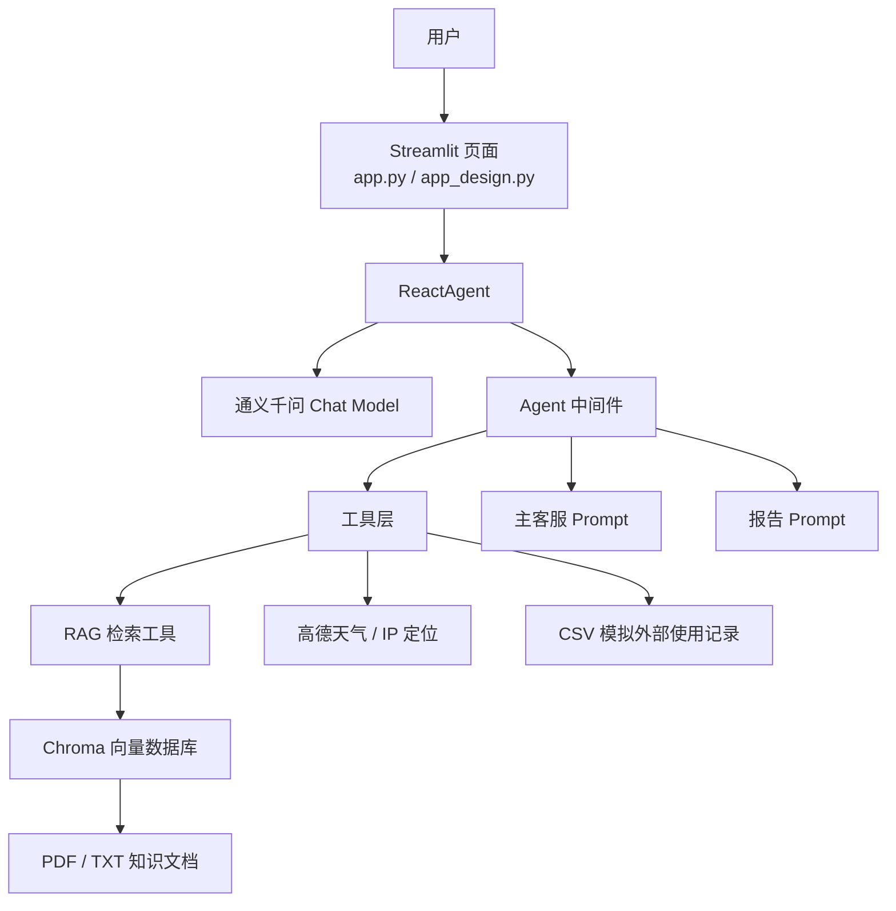

# MyAgent · 智能管家 🤖

> 一个面向用户的智能客服应用，基于 **LangChain Agent + RAG + Streamlit** 构建，支持产品知识问答、天气适配建议和使用报告生成。


---

## ✨ 项目亮点

- **Agent 工具编排**：模型根据用户意图自主选择知识库检索、天气、定位或报告数据查询等工具。
- **RAG 知识增强**：将 PDF/TXT 产品资料切块、向量化并存储到 Chroma，回答时召回最相关的资料，而不是只依赖模型自身知识。
- **动态 Prompt 切换**：报告意图触发运行时上下文标记，中间件将普通客服 Prompt 切换为报告专用 Prompt。
- **多轮对话与流式输出**：同一 Streamlit 会话保留短期聊天历史，回答以流式形式展示。
- **可观测性设计**：统一记录模型调用、工具名称、工具入参和工具执行结果，便于排查 Agent 调用链路。

---

## 🏗️ 系统架构



### 一次产品咨询如何完成

```text
用户提问
  → Agent 判断需要专业资料
  → 调用 rag_summarize
  → Chroma 召回 Top-K 文档片段
  → RAG Prompt 约束模型基于资料回答
  → Streamlit 流式展示最终答案
```

### 一次使用报告如何完成

```text
用户请求使用报告
  → Agent 获取模拟用户 ID 与月份
  → 调用 fill_context_for_report
  → 中间件设置 context["report"] = True
  → 动态切换为报告 Prompt
  → 查询 CSV 使用记录
  → 生成 Markdown 格式的报告与保养建议
```

---

## 📂 目录结构

```text
MyAgent/
├── app.py                         # 原始 Streamlit 页面入口
├── app_design.py                  # 设计版页面入口（推荐启动）
├── agent/
│   ├── react_agent.py             # Agent 创建、多轮历史、流式执行
│   └── tools/
│       ├── agent_tools.py         # RAG、天气、定位、报告数据工具
│       └── middleware.py          # 日志、工具监控、动态 Prompt 切换
├── rag/
│   ├── vector_store.py            # 文档加载、切块、Chroma 入库与检索
│   └── rag_service.py             # 召回资料后调用模型生成受约束回答
├── model/
│   └── factory.py                 # Chat Model / Embedding Model 工厂
├── utils/
│   ├── config_handler.py          # YAML 配置加载
│   ├── file_handler.py            # TXT/PDF 读取、MD5 计算
│   ├── logger_handler.py          # 控制台与文件日志
│   ├── path_tool.py               # 项目路径处理
│   └── prompt_loader.py           # Prompt 文本加载
├── config/
│   ├── agent.yml                  # 高德 API、CSV 数据路径
│   ├── chroma.yml                 # Chroma、分块与检索参数
│   ├── prompts.yml                # Prompt 路径映射
│   └── rag.yml                    # 模型配置
├── prompts/
│   ├── main_prompt.txt            # 普通客服与工具编排规则
│   ├── rag_summarize.txt          # RAG 回答约束
│   └── report_prompt.txt          # 使用报告输出规则
├── data/
│   ├── *.pdf / *.txt              # 知识资料
│   └── external/records.csv       # 模拟用户使用记录
├── requirements.txt
└── README.md
```

---

## 🧰 技术栈

| 类别 | 当前实现 | 作用 |
| --- | --- | --- |
| Web UI | Streamlit | 聊天界面、会话状态、流式输出 |
| Agent | LangChain `create_agent` | 模型调用、工具选择、执行循环 |
| Agent Runtime | LangGraph | 支撑 Agent 运行时状态与中间件机制 |
| Chat Model | `ChatTongyi` / `qwen3-max` | 理解意图、调用工具、生成回答 |
| Embedding | DashScope `text-embedding-v4` | 文本向量化与语义检索 |
| Vector Store | Chroma | 本地持久化向量存储与 Top-K 召回 |
| 外部服务 | 高德地图 REST API | 城市解析、天气与 IP 粗粒度定位 |
| 数据格式 | YAML / CSV / PDF / TXT | 配置、模拟记录与知识文档 |

---

## 🚀 快速开始

### 1. 环境要求

- Python **3.10+**
- 可用的 DashScope API Key
- 高德地图 Web 服务 API Key（天气/定位功能需要）

### 2. 克隆项目

```bash
git clone https://github.com/<你的GitHub用户名>/MyAgent.git
cd MyAgent
```

### 3. 创建虚拟环境并安装依赖

```bash
python -m venv .venv

# Windows PowerShell
.\.venv\Scripts\Activate.ps1

python -m pip install --upgrade pip
python -m pip install -r requirements.txt
```

### 4. 配置 API Key

#### DashScope

Windows PowerShell：

```powershell
$env:DASHSCOPE_API_KEY = "你的DashScope_API_Key"
```

> `ChatTongyi` 和 `DashScopeEmbeddings` 都会使用该环境变量。不要将真实 Key 写入 README、代码或公开仓库。

#### 高德地图

打开 `config/agent.yml`，仅在本地填写自己的 Key：

```yaml
external_data_path: data/external/records.csv
gaodekey: 你的高德Web服务Key
gaode_base_url: https://restapi.amap.com
gaode_timeout: 5
```

> 如果准备公开仓库，请勿提交真实高德 Key。提交前应改回占位文本，或将本地密钥配置拆分为被 `.gitignore` 忽略的文件。

### 5. 初始化知识库

将 PDF 或 TXT 文档放入 `data/` 后，执行：

```bash
python -m rag.vector_store
```

该命令会：读取文档 → 切块 → 调用 Embedding → 写入 Chroma。

项目使用 `md5.text` 记录已入库文件的 MD5，避免重复导入相同文件。

### 6. 启动应用

推荐启动设计版页面：

```bash
streamlit run app_design.py
```

或启动原始页面：

```bash
streamlit run app.py
```

默认访问地址：<http://127.0.0.1:8501>

---

## 💬 可体验的能力

### 产品知识问答

```text
吸力变弱怎么办？
滤网多久需要清理或更换一次？
小户型应该如何选择？
```

### 天气与清洁建议

```text
上海今天的天气怎么样？
杭州湿度高适合拖地吗？
```

### 使用报告

```text
帮我生成我的使用报告
生成本月保养建议
```

> 当前版本的用户 ID、月份与 `records.csv` 是为了演示 Agent 报告链路而准备的模拟数据，并非真实账号或设备平台数据。

---

## 🛠️ Agent 工具说明

| 工具 | 参数 | 作用 |
| --- | --- | --- |
| `rag_summarize` | `query` | 从 Chroma 知识库召回资料并生成受资料约束的回答 |
| `get_weather` | `city` | 将城市名解析为高德行政编码后查询实时天气 |
| `get_user_location` | 无 | 基于服务端公网 IP 获取粗粒度城市信息 |
| `get_user_id` | 无 | 返回报告流程使用的模拟用户 ID |
| `get_current_month` | 无 | 返回报告流程使用的模拟月份 |
| `fetch_external_data` | `user_id`, `month` | 从 CSV 查询模拟使用记录 |
| `fill_context_for_report` | 无 | 触发中间件进入报告 Prompt 模式 |

---

## 🔄 中间件机制

```text
monitor_tool
  ├─ 记录工具名和入参
  ├─ 记录调用成功或失败
  └─ 监听 fill_context_for_report，将 context["report"] 置为 True

log_before_model
  └─ 在每次模型调用前记录消息数与最近一条消息

report_prompt_switch
  ├─ report=False：加载 main_prompt.txt
  └─ report=True ：加载 report_prompt.txt
```

这使同一个 Agent 能在运行过程中从“客服问答模式”切换到“报告写作模式”，而不是为两种功能维护两套独立的 Agent。

---

## 📚 RAG 流程与参数

`config/chroma.yml` 的核心参数：

```yaml
chunk_size: 200
chunk_overlap: 20
k: 3
```

| 参数 | 含义 |
| --- | --- |
| `chunk_size` | 单个文本分块的最大长度，控制检索粒度和上下文大小 |
| `chunk_overlap` | 相邻分块的重叠长度，降低语义被切断的风险 |
| `k` | 每次检索返回的最相关资料数量 |

```text
用户问题 → 向量化 → Chroma Top-3 召回
→ 组装“问题 + 参考资料” → RAG Prompt
→ 模型生成基于资料的中文回答
```

---

## 🔮 可继续优化的方向

- 使用真实登录态替换随机用户 ID 与随机月份；
- 将 CSV 模拟数据源替换为业务数据库或设备平台 API；
- 将长期记忆持久化，并为超长上下文增加摘要与窗口裁剪；
- 对 RAG 增加重排序、引用来源展示、召回质量评测；
- 将 API Key 改为环境变量或密钥管理服务；
- 增加多用户隔离、权限控制、限流、异常重试与工具调用评测；
- 容器化部署，并接入监控、告警和链路追踪。

---

## 📄 免责声明

本项目用于学习 Agent、RAG、工具调用与 Streamlit 应用开发。天气、定位与使用报告功能依赖外部服务或模拟数据，不能替代真实设备诊断与售后服务。
